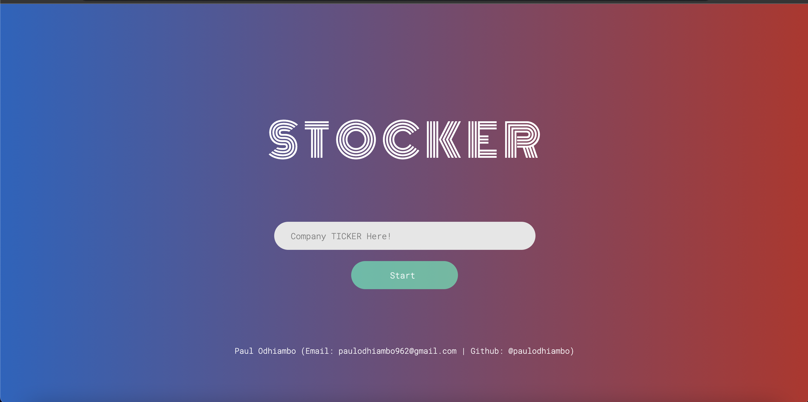

# Stocker - Stock Price Predictor


Stock market prediction is the act of trying to determine the future value of a company stock or other financial instrument traded on an exchange. The successful prediction of a stock's future price could yield significant profit. The efficient-market hypothesis suggests that stock prices reflect all currently available information and any price changes that are not based on newly revealed information thus are inherently unpredictable. Others disagree and those with this viewpoint possess myriad methods and technologies which purportedly allow them to gain future price information.

We make use of Facebook's Time Series forcasting algorithm Prophet to predict stock market price of US based companies in real time using multi-variate, single step forecasting strategy.



## Getting Started

Download or clone project from github:
```
$ git clone https://github.com/paulodhiambo/stocker.git
```

Create a project environment (Anaconda recommended):
```
$ conda create --name envname python
$ conda activate envname
```

Install prerequisites:
```
$ pip install -r REQUIREMENTS.txt
```

Run project:
```
$ cd stocker
$ python runserver.py
```

## Model Validation Analysis

**Facebook (Stock: FB) Validation**


**Microsoft (Stock: MSFT) Validation**


**Google (Stock: GOOGL) Validation**

