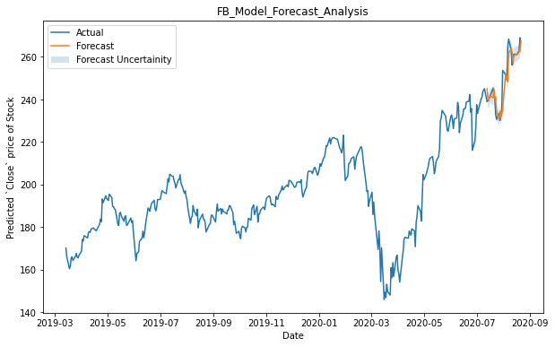

#### NAME:  ODHIAMBO PAUL OCHIENG
#### REG NO: SCT212-0076/2018
#### COURSE: COMPUTER TECHNOLOGY
#### PROJECT: STOCK MARKET ANALYSIS USING FBPROPHETX

Stock market prediction is the act of trying to determine the future value of company stock or other financial instruments traded on an exchange. The successful prediction of a stock's future price could yield significant profit. The efficient-market hypothesis suggests that stock prices reflect all currently available information, and any price changes that are not based on newly revealed information thus are inherently unpredictable. Others disagree, and those with this viewpoint possess numerous methods and technologies which purportedly allow them to gain future price information.

I use Facebook's Time Series forecasting algorithm Prophet to predict the stock market price of US-based companies in real-time using a multi-variate, single-step forecasting strategy.

### Project Structure
1. Notebooks - this module contains all the prediction algorithms source code.
2. Static - this module contains all the static files like images, css, js etc.
3. Templates - this module contains all the templates for the website.

### Main Page
This page contains a input field where in input the company name for which we want to predict the stock price. The page also has a button which when clicked, it will call the prediction algorithm and display the predicted stock price based on current stocks of the company.

#### Views Source code
Below is the complete source code for the home page.
```html
<!doctype html>
<html ang="en">
<head>
    <meta charset="utf-8">
    <meta http-equiv="X-UA-Compatible" content="IE=edge,chrome=1">
    <title>Dashboard</title>
    <meta name="description" content="">
    <meta name="viewport" content="width=device-width, initial-scale=1">
	<!-- CSS -->
	<link rel="stylesheet" href="../static/css/style.css">
    <link rel="stylesheet" href="../static/css/font-awesome.min.css">
	<link rel="stylesheet" href="../static/css/bootstrap.min.css">
	<link rel="stylesheet" type="text/css" href="../static/form-static/util.css">
    <link rel="stylesheet" type="text/css" href="../static/form-static/main.css">
</head>

<!-- Body content -->
<body>
	<div class="container-fluid">
		<div class="row">
			<div class="blank200">
				<!-- Blank Space -->
			</div>
		</div>
		<div class="row">
			<div class="col-sm-1">
			</div>
			<div class="col-sm-10">
				<center>
					<h1 class="tagline">S T O C K E R</h1>
				</center>
			</div>			
			<div class="col-sm-1">
			</div>
		</div>
		<div class="row">
			<div class="blank100">
				<!-- Blank Space -->
			</div>
		</div>
		<div class="row">
			<div class="col-sm-2"></div>
			<div class="col-sm-8">
				<center>
					<form class="contact1-form validate-form" action="/predict" method="POST" enctype="multipart/form-data">
						<div class="wrap-input1 validate-input" data-validate="Company TICKER is required">
							<input  autocomplete="off" class="input1" type="text" name="ticker" id="ticker" placeholder="Company TICKER Here!">
							<span class="shadow-input1"></span>
						</div>
						<div class="container-contact1-form-btn">
							<button class="contact1-form-btn">
								<span>Start<i class="" aria-hidden="true"></i></span>
							</button>
						</div>
					</form>						
				</center>
			</div>
			<div class="col-sm-2"></div>
		</div>
		<div class="row">
			<div class="blank100">
				<!-- Blank Space -->
			</div>
		</div>
		<div class="row footer">
			<center>Paul Odhiambo (Email: paulodhiambo962@gmail.com | Github: @paulodhiambo)</center>
		</div>
	</div>
</body>
</html>
```
### Result Page
After making a server request, the result page will display the predicted stock price of the company. The result page shows the predicted stock price of the company and the actual stock price of the company within the last 1 year.

```html
<!doctype html>
<html ang="en">
<head>
    <meta charset="utf-8">
    <meta http-equiv="X-UA-Compatible" content="IE=edge,chrome=1">
    <title>Dashboard</title>
    <meta name="description" content="">
    <meta name="viewport" content="width=device-width, initial-scale=1">
	<!-- CSS -->
	<link rel="stylesheet" href="../static/css/style.css">
    <link rel="stylesheet" href="../static/css/font-awesome.min.css">
    <link rel="stylesheet" href="../static/css/bootstrap.min.css">
</head>

<!-- Body content -->
<body>
	<div class="container-fluid">
		<div class="row">
			<div class="col-sm-10">
				<h2 class="white_text">{{ticker}} |  {{sector}} | {{country}} | {{website}}</h2>
			</div>
			<div class="col-sm-2">
				<br>
				<a href="http://localhost:5555/" class="btn btn-lg btn-success">New Forecast</a>
			</div>
		</div>
		<div class="row">
			<div class="blank100">
				<!-- Blank Space -->
			</div>
		</div>
		<div class="row">
			<div class="col-sm-1">
			</div>
			<div class="col-sm-10">
				<p>
					<strong>
						About Organization
					</strong>
				</p>
				<h4 class="white_text">{{summary}}</h4>
			</div>			
			<div class="col-sm-1">
			</div>
		</div>
		<div class="row">
			<div class="blank100">
				<!-- Blank Space -->
			</div>
		</div>
		<div class="row">
			<div class="col-sm-6">
				<p>
					<strong>
						Train History
					</strong>
				</p>
				<h2 class="white_text">{{min_date}} -> {{max_date}}</h2>
			</div>
			<div class="col-sm-2">
				<p>
					<Strong>
						Forecast Date
					</Strong>
				</p>
				<h2 class="white_text">
					{{forecast_date}}
				</h2>
			</div>
			<div class="col-sm-2">
				<p>
					<Strong>
						Forecast (Closing Price)
					</Strong>
				</p>
				<h2 class="white_text">
					{{forecast}}
				</h2>
			</div>
			<div class="col-sm-2">
				<p>
					<Strong>
						Uncertainity
					</Strong>
				</p>
				<span class="green_text">+</span>
				<span class="red_text">-</span>
				<span class="blue_text">{{bound}}</span>
			</div>
		</div>
		
		<div class="row">
			<div class="blank100">
				<!-- Blank Space -->
			</div>
		</div>
		<div class="row footer">
			<center>Nityan Suman (Email: nityan.suman@gmail.com | Github: @nityansuman)</center>
		</div>
	</div>
</body>
</html>
```
### Prediction Page
The actual create the predictions based on the company name that have been input, the code snippet below predicts the stock price of the company based on the current company stock price and the historical stock price of the company.

```python
import datetime

import fbprophet as prophet
import pandas as pd
import yfinance as yf


class Dataset:
	def build_dataset(self):
		start_date = datetime.datetime(2010, 1, 1).date()
		end_date = datetime.datetime.now().date()

		try:
			self.dataset = self.socket.history(start=start_date, end=end_date, interval="1d").reset_index()
			self.dataset.drop(columns=["Dividends", "Stock Splits", "Volume"], inplace=True)
			self.add_forecast_date()
		except Exception as e:
			print("Exception raised at: `utils.Dataset.build()", e)
			return False
		else:
			return True

	def add_forecast_date(self):
		present_date = self.dataset.Date.max()
		day_number = pd.to_datetime(present_date).isoweekday()
		if day_number in [5, 6]:
		    self.forecast_date = present_date + datetime.timedelta(days=(7-day_number) + 1)
		else:
		    self.forecast_date = present_date + datetime.timedelta(days=1)
		print("Present date:", present_date)
		print("Valid Forecast Date:", self.forecast_date)
		test_row = pd.DataFrame([[self.forecast_date, 0.0, 0.0, 0.0, 0.0]], columns=self.dataset.columns)
		self.dataset = pd.concat([self.dataset, test_row])


class FeatureEngineering(Dataset):
	def create_features(self):
		status = self.build_dataset()
		if status:
			self.create_lag_fetaures()
			self.impute_missing_values()
			self.dataset.drop(columns=["Open", "High", "Low"], inplace=True)
			print(self.dataset.tail(3))
			return True
		else:
			raise Exception("Dataset creation failed!")

	def create_lag_fetaures(self, periods=12):
		for i in range(1, periods+1):
		    self.dataset[f"Close_lag_{i}"] = self.dataset.Close.shift(periods=i, axis=0)
		    self.dataset[f"Open_lag_{i}"] = self.dataset.Open.shift(periods=i, axis=0)
		    self.dataset[f"High_lag_{i}"] = self.dataset.High.shift(periods=i, axis=0)
		    self.dataset[f"Low_lag_{i}"] = self.dataset.Low.shift(periods=i, axis=0)
		return True

	def impute_missing_values(self):
		self.dataset.fillna(0, inplace=True)
		self.info["min_date"] = self.dataset.Date.min().date()
		self.info["max_date"] = self.dataset.Date.max().date() - datetime.timedelta(days=1)
		return True


class MasterProphet(FeatureEngineering):
	def __init__(self, ticker):
		self.ticker = ticker
		self.socket = yf.Ticker(self.ticker)
		self.info = {
			"sector": self.socket.info["sector"],
			"summary": self.socket.info["longBusinessSummary"],
			"country": self.socket.info["country"],
			"website": self.socket.info["website"],
			"employees": self.socket.info["fullTimeEmployees"]
		}

	def build_model(self):
		additonal_features = [col for col in self.dataset.columns if "lag" in col]
		try:
			self.model = prophet.Prophet(yearly_seasonality=True, weekly_seasonality=True, seasonality_mode="additive")
			for name in additonal_features:
				self.model.add_regressor(name)
		except Exception as e:
			print("Exception raised at: `utilities.Prophet.build()`", e)
			return False
		else:
			return True

	def train_and_forecast(self):
		self.model.fit(df=self.dataset.iloc[:-1, :].rename(columns={"Date": "ds", "Close":"y"}))
		return self.model.predict(self.dataset.iloc[-1:][[col for col in self.dataset if col != "Close"]].rename(columns={"Date": "ds"}))

	def forecast(self):
		self.create_features()
		self.build_model()
		return self.train_and_forecast()

```
### Web application routes
To render the templates to a browser, I added a view file that handles all the incoming rerquests and returns a desired response to the output.html file.

```python
rom flask import render_template, request

from src import app
from src.utilities import MasterProphet


@app.after_request
def add_header(response):
	response.headers["X-UA-Compatible"] = "IE=Edge,chrome=1"
	response.headers["Cache-Control"] = "public, max-age=0"
	return response

@app.route("/")
@app.route("/home")
def home():
	""" Renders the home page """
	return render_template(
		"index.html"
	)

@app.route("/predict", methods=["POST", "GET"])
def predict():
	ticker = request.form["ticker"]
	master_prophet = MasterProphet(ticker)

	forecast = master_prophet.forecast()

	actual_forecast = round(forecast.yhat[0], 2)
	lower_bound = round(forecast.yhat_lower[0], 2)
	upper_bound = round(forecast.yhat_upper[0], 2)
	bound = round(((upper_bound - actual_forecast) + (actual_forecast - lower_bound) / 2), 2)

	summary = master_prophet.info["summary"]
	country = master_prophet.info["country"]
	sector = master_prophet.info["sector"]
	website = master_prophet.info["website"]
	min_date = master_prophet.info["min_date"]
	max_date = master_prophet.info["max_date"]

	forecast_date = master_prophet.forecast_date.date()

	return render_template(
		"output.html",
		ticker = ticker.upper(),
		sector = sector,
		country = country,
		website = website,
		summary = summary,
		min_date = min_date,
		max_date = max_date,
		forecast_date = forecast_date,
		forecast = actual_forecast,
		bound = bound
		)

```

### Main application file
The application is a FLask application. To the the application a main funtion is required, which is the entry point of the application.

```python
import os

from src import app


if __name__ == "__main__":
    HOST = os.environ.get("SERVER_HOST", "localhost")
    try:
        PORT = int(os.environ.get("SERVER_PORT", "5555"))
    except ValueError:
        PORT = 1234
    app.secret_key = "1cd6f35db029d4b8fc98fc05c9efd06a2e2cd1ffc3774d3f035ebd8d"
    app.run(HOST, PORT, debug=True)
```

### Application dependencies
I used the following dependencies in the project.

```txt
fbprophet==0.6
Flask==1.1.2
matplotlib==3.3.1
numpy==1.21.0
pandas==1.1.0
yfinance==0.1.54
Pillow==9.0.0
plotly==4.9.0
protobuf==3.13.0
requests==2.24.0
rsa==4.7
scipy==1.4.1
setuptools-git==1.2
SQLAlchemy==1.3.18
tensorboard==2.3.0
tensorboard-plugin-wit==1.7.0
tensorflow>=2.3.1
tensorflow-estimator==2.3.0
urllib3==1.26.5

```
#### The application styles
To style the index.html page and output.html pages, I used the styles below.

```css
/* Define body style */
body {
	font-family: "Roboto";
	color: white;
	background: #b92b27;  /* fallback for old browsers */background: -webkit-linear-gradient(to right, #1565C0, #b92b27);  /* Chrome 10-25, Safari 5.1-6 */
	background: linear-gradient(to right, #1565C0, #b92b27); /* W3C, IE 10+/ Edge, Firefox 16+, Chrome 26+, Opera 12+, Safari 7+ */
}


/* Fill blank */
.blank {
    height: 50px;
}

.blank100 {
    height: 100px;
}

.blank200 {
    height: 200px;
}

.blank300 {
    height: 300px;
}


/* Content */
.tagline {
    font-family: "Monoton";
    font-size: 80px;
    color: white;
}

.white_text { 
    color: white;
}

.red_text {
    color: red;
    font-size: xx-large;
}

.green_text {
    color: green;
    font-size: xx-large;
}

.blue_text {
    color: cyan;
    font-size: xx-large;
}

p {
    color: white;
    font-size: medium;
}

/* Footer */
.footer {
    background-color: transparent;
    text-align: center;
    color: white;
}


/* Import external fonts */
@font-face{
    font-family: "Roboto";
    src: url("../fonts/Roboto_Mono/RobotoMono-Light.ttf")
}
@font-face{
    font-family: "Monoton";
    src: url("../fonts/Monoton/Monoton-Regular.ttf")
}
```
### Testing application
The page below, is where we input the name of the company that we would like to see its stock prediction.


When we input facebook, we get the following output in the output.html page. The output indicates that the facebook stock is likely to go up by 0.5% in the next few weeks.



When we input the company name as Google, we get the following output in the output.html page. The output indicates that the Google stock is likely to go up in the next few weeks but not as high as the Facebook stock.


When we finally input the company name as microsoft, we get the following output in the output.html page. The output indicates that the Microsoft stock is likely to go down and then rise in the next few weeks.


### Conclusion
Stock Market are the best alternative for a business to grow, and it's a sideway income for the individuals who are ready to invest and earn from the same. The term stock has been in the picture ever since, and it's growing in bulk every day. There are thousands of investors investing in the same and making a fortune out of it.

There are middle-level agents and stock vendors who learn and invest. However, the cost for the consultation on the stock is bulky and expensive. So when it comes to people, they think a lot and invest, and there's no chance and certainty for the same to produce a yield result.

So the stock is unpredictable, and the tendency to grow is higher than ever. If we can do the stock market and its prediction accurately, it will be again for both the individuals and the organization. The risk factor has to be mitigated so the system's efficiency should be high and people can be sure about their investment in time.

We can further continue the project to gain the effectiveness of the prediction with additional implementations of the content that can involve real-time scenarios and the way of executing and processing the real-time system. Various constraints have to be added, and performance of the same can be acylated in the future for effective results.